<p align="center">
  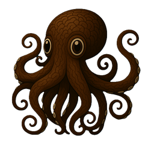
</p>

# Oktopios 🐙 

Oktopios est un langage de programmation expérimental, moderne et expressif, interprété en Python. Il combine une syntaxe lisible, un modèle orienté objet, des fonctions avancées, des modules natifs et une architecture bio-inspirée appelée architecture pieuvrique.

L'objectif du projet est de construire un langage capable d'orchestrer des unités d'exécution locales comme des tentacules autour d'un cerveau central. Oktopios n'est donc pas seulement un langage de script : c'est une base pour explorer l'exécution distribuée interne, les matrices, l'adaptation IA et les systèmes modulaires.

## Galerie des versions 🐙

Chaque version enrichit la bibliothèque standard d'Oktopios avec un nouveau
namespace natif (sans dépendance lourde). Évolution du projet, de la première
version à la plus récente :

<p align="center">
  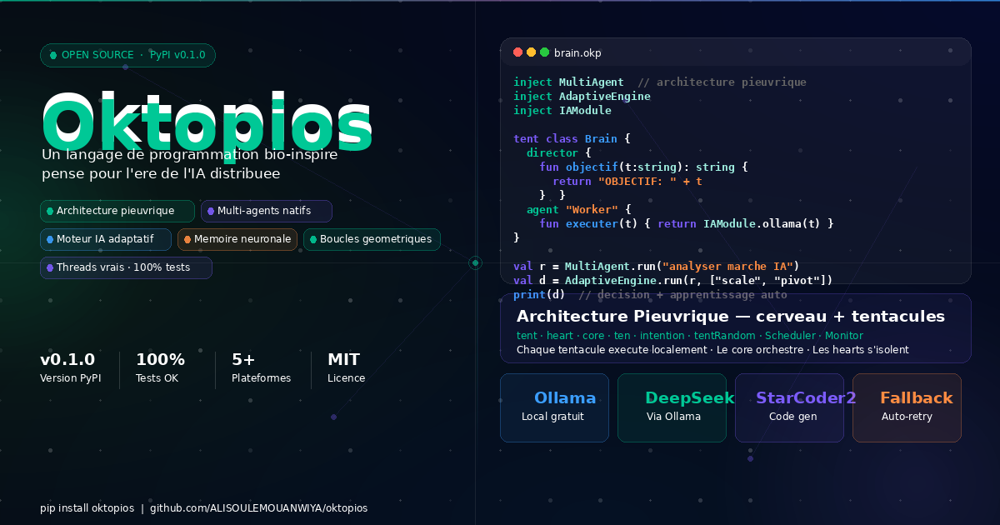
</p>

| Version | Apport | Aperçu |
|:--|:--|:--:|
| **0.1.1** | Bibliothèque standard enrichie & corrections de ressources | 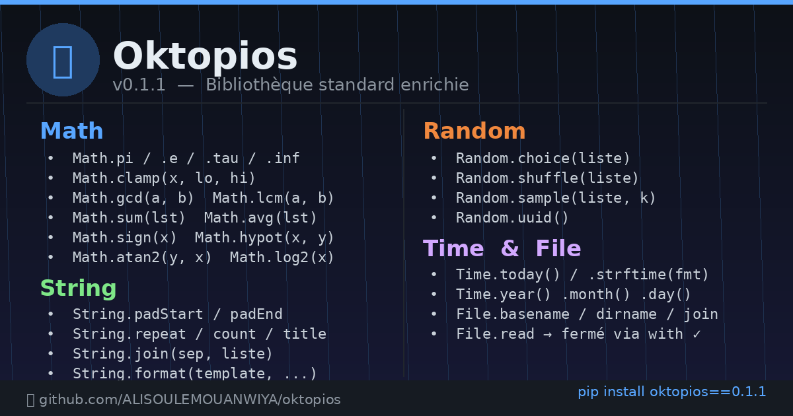 |
| **0.1.2** | Namespace `List` fonctionnel & types enrichis | 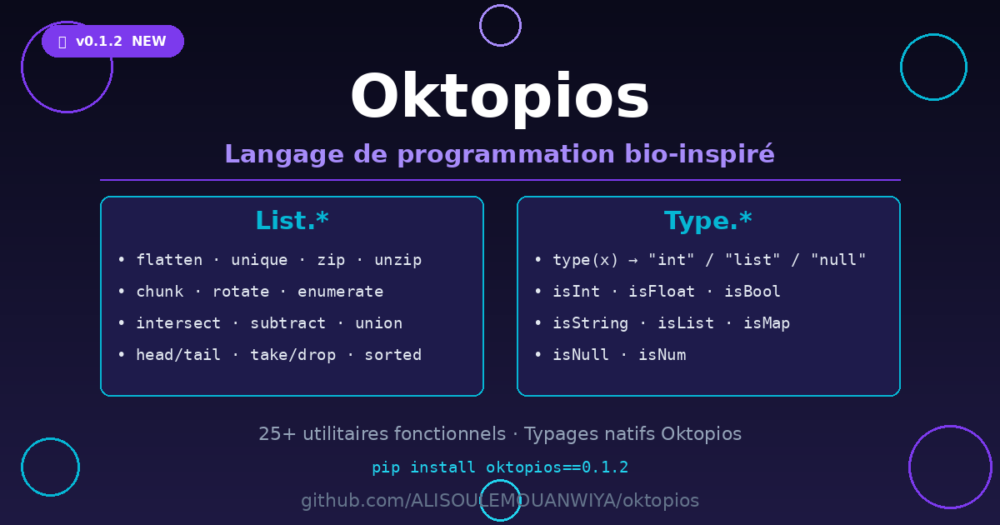 |
| **0.1.3** | Namespace `Map` & correction doublon IAModule | 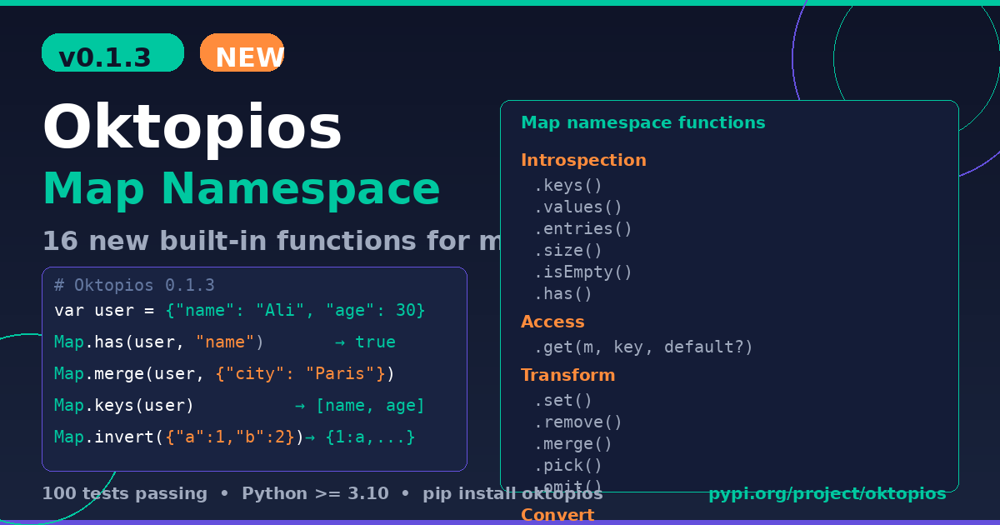 |
| **0.1.4** | Namespace `Regex` — expressions régulières natives | 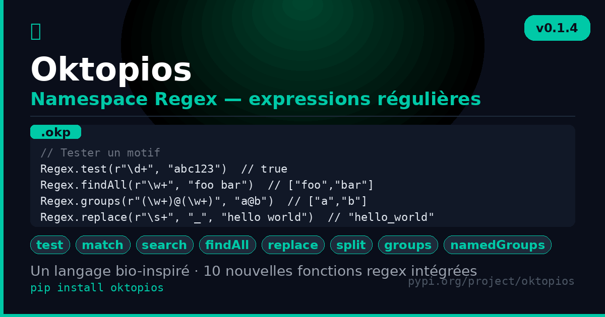 |
| **0.1.5** | Namespace `Date` — arithmétique et manipulation de dates | 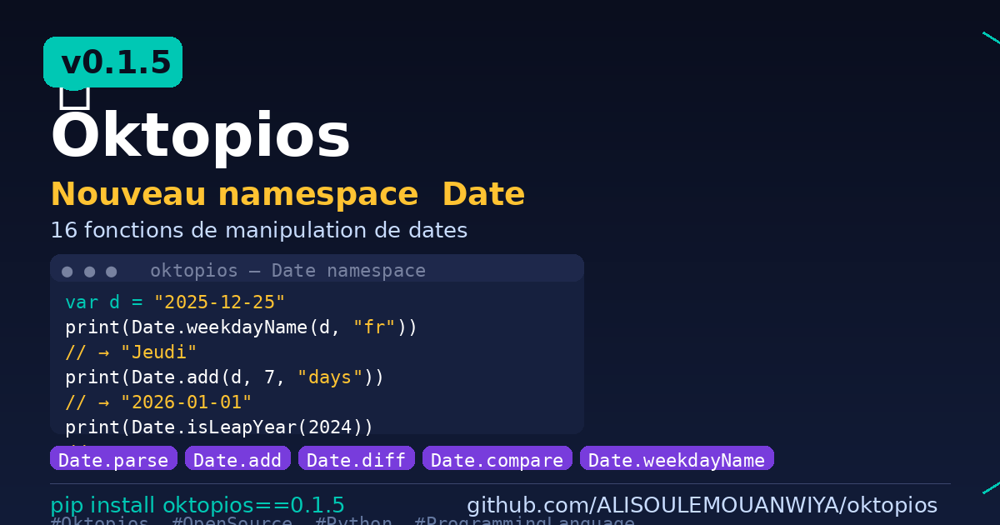 |
| **0.1.6** | Namespace `Json` — manipulation JSON en mémoire | 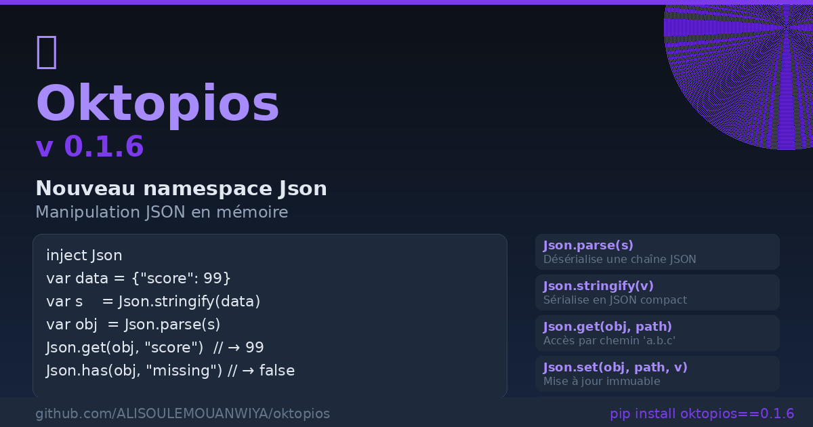 |
| **0.1.7** | Namespace `Http` — requêtes HTTP natives | 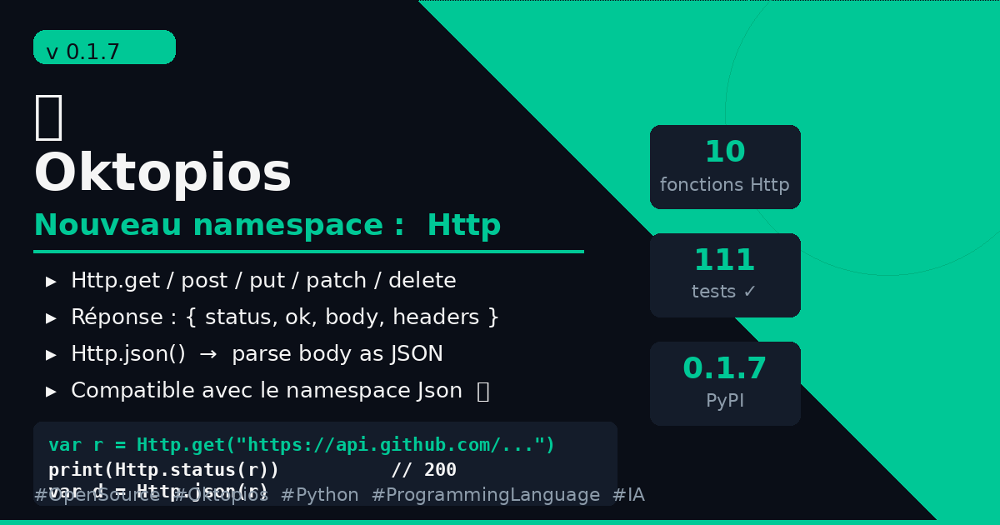 |
| **0.1.8** | Namespace `Set` — ensembles mathématiques natifs | 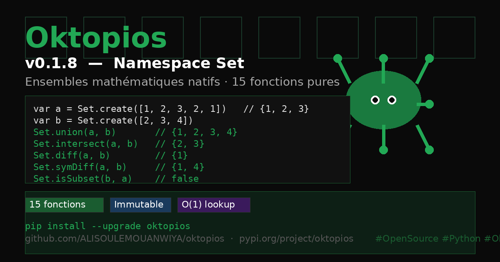 |
| **0.1.9** | Namespaces `Queue` & `Stack` — structures de données natives | 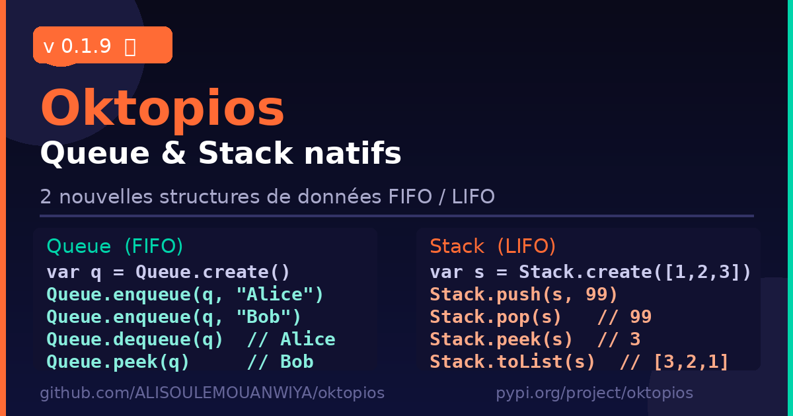 |
| **0.2.0** | Namespace `Hash` — hachage cryptographique & encodage Base64 | 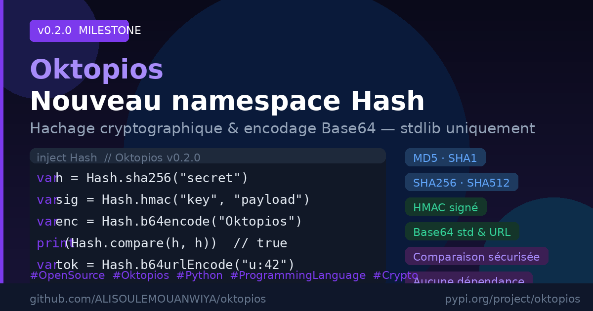 |
| **0.2.1** | Namespace `Stats` — statistiques descriptives natives | 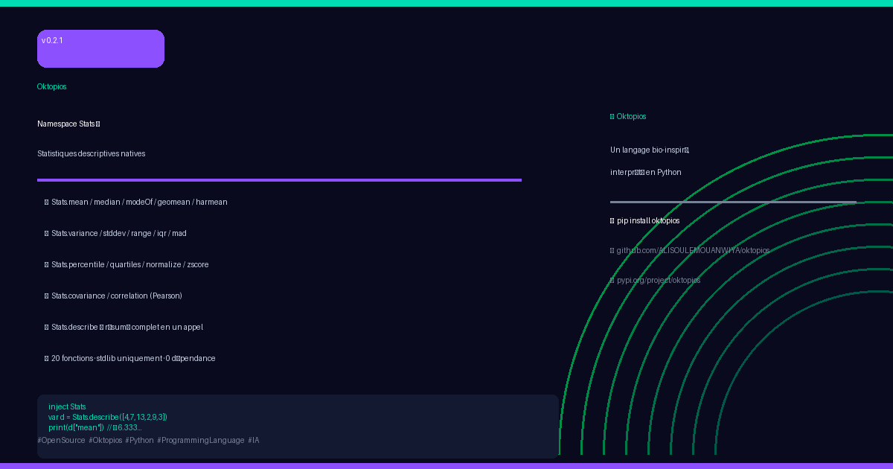 |
| **0.2.2** | Namespace `Path` — manipulation de chemins de fichiers | 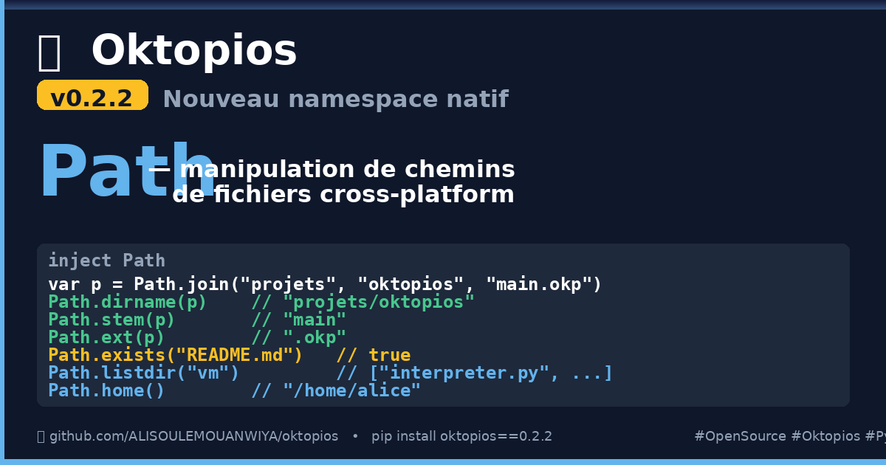 |
| **0.2.3** | Namespace `Csv` — lecture et écriture CSV native | 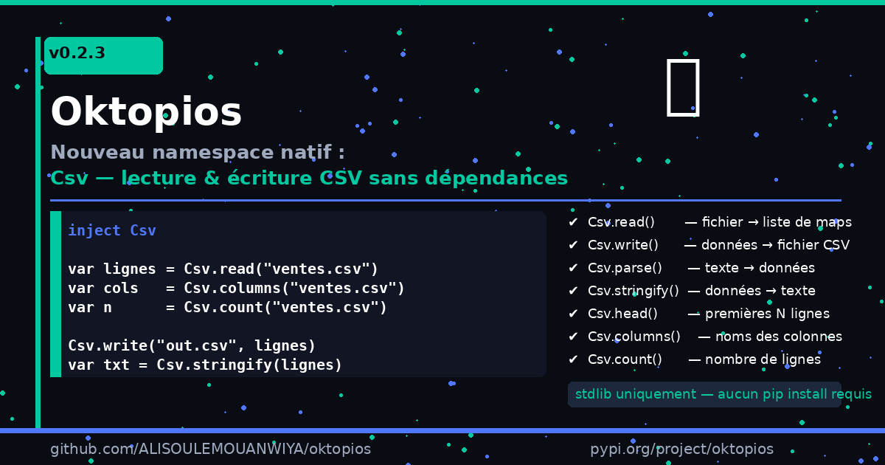 |
| **0.2.4** | Namespace `Table` — rendu de tableaux formatés en texte | 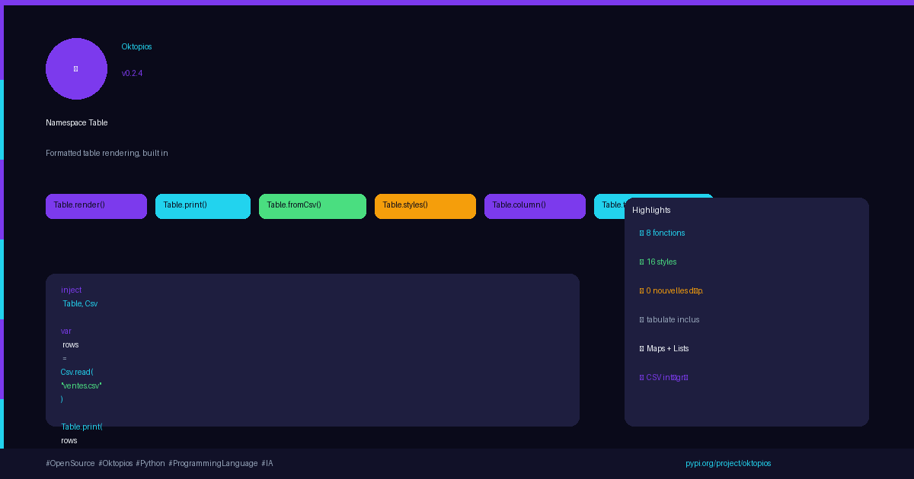 |
| **0.2.5** | Namespace `Fmt` — formatage humain de valeurs (nombres, %, monnaie, octets, durées…) | 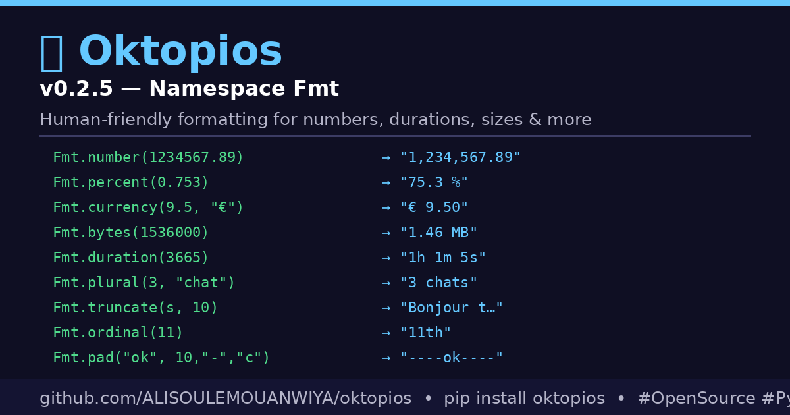 |

## Vision 🐙 

Oktopios s'inspire de l'organisation d'une pieuvre :

- un cerveau central pour la gouvernance et l'orchestration ;
- plusieurs coeurs spécialisés pour l'exécution, la circulation des données et l'adaptation ;
- des tentacules capables d'exécuter localement des tâches ;
- un mécanisme d'intention pour diffuser des ordres ;
- une distribution aléatoire ou dynamique des tâches avec `tentRandom` ;
- une ouverture vers des modules IA adaptatifs comme Ollama, DeepSeek ou StarCoder.

Cette vision se traduit progressivement dans le langage avec les mots-clés :

```okp
tent
heart
core
ten
intention
tentRandom
```

## Installation 🐙 

### Depuis PyPI

```bash
pip install oktopios
```

L'installation de base est **100 % pur Python** (Python **3.8+**), sans aucune
compilation — elle s'installe donc partout, y compris sur Termux/Android. Pour
des fonctionnalités supplémentaires, installez l'extra correspondant :

```bash
pip install oktopios[system]        # System.uptime / memory_info (psutil)
pip install oktopios[data]          # json/excel/sql/mysql
pip install oktopios[recognition]   # reconnaissance faciale/vocale
pip install oktopios[ia]            # Ollama/DeepSeek/StarCoder
pip install oktopios[all]           # tout d'un coup
```

Après installation :

```bash
okp --version
okp 'print("Bonjour Oktopios")'
```

### Depuis les sources 🐙 

```bash
git clone https://github.com/ALISOULEMOUANWIYA/oktopios.git
cd oktopios
pip install -e .
```

### Windows 🐙

```powershell
pip install oktopios
okp-setup
okp --version
```

Si la commande `okp` n'est pas reconnue, ouvrez un nouveau terminal ou ajoutez le dossier Scripts de Python au `PATH`.

### Linux et macOS 🐙

```bash
pip install oktopios
okp --version
```

Depuis le dépôt :

```bash
bash installers/linux/install.sh
# ou
bash installers/macos/install.sh
```

### Android avec Termux 🐙

Installez Termux depuis F-Droid, puis :

```bash
pkg install python git -y
pip install oktopios
okp --version
```

Le cœur d'Oktopios est pur Python et ne dépend d'aucune extension à compiler,
donc l'installation fonctionne même sur les anciens builds de Termux. Si votre
Python est plus ancien que 3.8 et que `pip` refuse l'installation, forcez-la :

```bash
pip install --ignore-requires-python oktopios
```

### iPhone ou iPad avec iSH 🐙

```sh
apk update
apk add python3 py3-pip
pip install oktopios
okp --version
```

## Utilisation rapide 🐙

```bash
# Exécuter un fichier
okp programme.okp

# Exécuter du code inline
okp 'print("Bonjour")'

# Lancer le REPL
okp --repl

# Afficher l'aide
okp --help
```

## Premier programme 🐙

```okp
val nom: string = "Oktopios"
print("Bonjour " + nom)
```

## Syntaxe de base 🐙 

### Variables 🐙 

```okp
val x: int = 10          // constante
var compteur: int = 0    // variable mutable
var message = "Salut"    // type inféré
```

**Déclarations multiples** (deux formes) :

```okp
var x, y, a, b, c : int = 1, 2, 3, 4, 5   // type partagé, valeurs appariées par position
var x = 1, y = 2, a = 3                    // chaque variable a sa propre valeur/type inféré
```

**Valeur par défaut selon le type**, si rien n'est assigné :

```okp
var n: int      // 0
var f: float    // 0.0
var b: bool     // false
var tab: int[]  // []
var d: dict     // {}
var s: string   // null
```

**Le littéral `null`** existe aussi directement :

```okp
var x = null
```

### Fonctions 🐙 

```okp
fun add(a: int, b: int): int {
    return a + b
}

print(add(2, 3))
```

### Surcharge 🐙 

```okp
fun calcule(a: int, b: int): int {
    return a + b
}

fun calcule(a: int, b: int, c: int): int {
    return (a + b) * c
}
```

### Lambdas 🐙 

```okp
val doubler = lambda(x: int) => x * 2
print(doubler(5))
```

### Conditions 🐙 

```okp
if (compteur > 10) {
    print("grand")
} elif (compteur == 10) {
    print("égal")
} else {
    print("petit")
}
```

### Boucles 🐙 

```okp
for (var i: int = 0; i < 5; i += 1) {
    print(i)
}

var noms: string[] = ["Awa", "Mouanwiya", "Ali"]
for (nom in noms) {
    print(nom)
}
```

**Boucles spéciales**, chacune avec sa propre sémantique (pas de simples variantes de `for`) :

```okp
filterLoop(n in nums): where(n > 4) { print(n) }

sortLoop(n in nums): by(n) order desc { print(n) }

permuteLoop(n in nums): using(partenaire) mode(stable) { print(n + " / " + partenaire) }
// modes : stable, reverse, cycle, chaos, noise, random

circularLoop(n in nums): step(1) until(total > 50) { total = total + n }

filterWhile(n in nums): whenever(n > 3) check(n < 8) { print(n) }

// --- parcours géométriques (bio-inspirés) ---
spiral cell in matrice { print(cell) }                    // depuis le centre, sens horaire (défaut)
spiral cell in matrice from top_left counterclockwise { }
spiral (x, y) in matrice { print(x + "," + y) }           // indices plutôt que valeurs

wave row in matrice { print(row) }                         // zig-zag par ligne (défaut)
wave col in matrice by column { print(col) }
wave item in liste amplitude 3 { print(item) }             // zig-zag sur liste plate

sectors part in liste count 8 { print(part) }              // découpage en 8 morceaux
sectors part in liste count 8 parallel { print(part) }      // chaque secteur sur un vrai thread
sectors zone in image rows 4 cols 4 { process(zone) }       // découpage matriciel en blocs
```

## Classes et objets 🐙 

```okp
class Animal {
    var nom: string

    fun __construct(n: string) {
        this.nom = n
    }

    fun parler(): string {
        return this.nom + " dit bonjour"
    }
}

var chat = new Animal("Mimi")
print(chat.parler())
```

Oktopios 🐙 prend aussi en charge progressivement :

- interfaces ;
- classes abstraites ;
- héritage ;
- `override` ;
- `super` ;
- énumérations ;
- méthodes statiques ;
- visibilité `public`, `private`, `protected`, `global`.

## Pattern matching avec `__matches__` 🐙 

`__matches__` permet de comparer une valeur contre plusieurs formes. Il peut retourner plusieurs résultats si plusieurs cas sont vrais.

```okp
val x = 20
val y = 20
var list: string[] = ["@Nabile", "@Soultan", "@Abdallah"]

val r = __matches__ x => {
    1                 => "one"
    2, 3              => "two or three"
    4|10              => "dans le range [4:10]"
    in list           => "dans la liste"
    like y            => f"x{x} = y{y}"
    between 18 and 30 => f"{x} appartient à [18:30]"
    is int            => "integer"
    else              => "other"
}

print(r)
```

Patterns supportés :

- valeurs simples : `1`, `"hello"` ;
- plusieurs valeurs : `2, 3` ;
- intervalle : `4|10` ;
- appartenance : `in list` ;
- ressemblance ou contenance : `like value` ;
- intervalle explicite : `between 18 and 30` ;
- regex : `matches "[a-z]+"` ;
- type : `is int`, `is string`, `is float`, `is bool` ;
- fallback : `else`.

## Mémoire associative avec `neuron_loop` / `__matches_db__` 🐙 

`__matches__` compare une valeur ponctuelle. `__matches_db__` interroge une
vraie base mémoire persistante, inspirée du système nerveux distribué d'une
pieuvre (5 catégories : alpha/beta/gamma/ohm/dzêta).

```okp
neuron_loop ElementorDB {
    neuro_1{
        enter{ alpha: 1 },
        memory{ alpha{ ref_el_1{ id: 1 => data: { "forme": "ronde" } } } },
        elementor{ alpha{ ref_el_1{ id: 1 => data: { "forme": "ronde" } } } },
        out_6{ target: neuro_2  alpha: 6 }
    }
}

val r = "ronde" __matches_db__ ElementorDB { "forme": "ronde" }
print(r)

// Tous les verbes passent par la MÊME étape de correspondance avant d'agir
val r2 = "carre" __matches_db__ ElementorDB insert alpha { "forme": "carre" }
val r3 = "ronde" __matches_db__ ElementorDB update { "forme": "ronde" } set { "song": "aigu" }
val r4 = "ronde" __matches_db__ ElementorDB delete { "forme": "ronde" }
val r5 = "aigu" __matches_db__ ElementorDB reflexion { "song": "aigu" }  // associatif, seuil=1

// Persistance disque
inject MatchesDB
MatchesDB.save("ElementorDB", "sauvegarde.json")
MatchesDB.load("ElementorDB", "sauvegarde.json")
```

`threshold N` ajuste le seuil de déclenchement (par défaut : toutes les
conditions du motif). `target:` dans un `out_X{}` relie un neurone au
suivant : un signal qui dépasse le seuil se propage le long de cette chaîne
(reporté dans `propagation` du résultat) tant que le neurone suivant répond
lui aussi — sinon il s'arrête là.

## Moteur adaptatif et IA externe

```okp
inject AdaptiveEngine
inject IAModule

tent class Brain {
    core {
        fun agir(decision: string): string { return "ACTION: " + decision }
    }
}

val r = AdaptiveEngine.run("charge serveur elevee", ["scale_up", "scale_down", "ne_rien_faire"])
print(r)   // decision, raison, feedback, ia_response...
print(AdaptiveEngine.recall("charge serveur elevee"))   // rappelle les expériences passées
```

`AdaptiveEngine.run` enchaîne IAModule → analyse → décision → action
(`agir()` dans `core{}`/`director{}`) → feedback → apprentissage (mémorisé
dans un `neuron_loop` dédié). Si l'IA est indisponible, une heuristique de
repli décide quand même — jamais de blocage.

DeepSeek et StarCoder sont open source et tournent directement via
[Ollama](https://ollama.com), gratuitement, sans clé :

```bash
ollama pull llama3
ollama pull deepseek-r1
ollama pull starcoder2
ollama serve
```

```okp
print(IAModule.ollama("Bonjour"))
print(IAModule.deepseek("Bonjour"))      // route vers Ollama si pas de clé fournie
print(IAModule.starcoder("Bonjour"))     // idem
print(IAModule.callWithFallback("Bonjour", backends))   // cascade de secours
IAModule.ollamaStream("Raconte", surChaqueMorceau)        // streaming avec callback
```

## Connecteurs de données et reconnaissance

```okp
inject DataImport
var lignes = DataImport.readJson("data.json")     // aussi : readExcel, readSQL, readMySQL
DataImport.writeJson("sortie.json", lignes)         // aussi : writeExcel, writeSQL, writeMySQL

inject Recognize
print(Recognize.textSimilarity("ronde", "ronde "))
var empreinte = Recognize.facial("photo.jpg")        // détection + empreinte hors-ligne
var voix = Recognize.vocal("audio.wav")              // empreinte MFCC hors-ligne
```

Ces connecteurs nécessitent les extras correspondants :
`pip install oktopios[data]`, `[recognition]` ou `[ia]` (ou `[all]` pour tout).

## Architecture pieuvrique

Oktopios introduit une architecture bio-inspirée pour organiser l'exécution.
Chaque `heart{}` est **isolé** des autres (ses fonctions/variables ne
collisionnent jamais entre eux), tandis que `core{}` est le **noyau
partagé** que tous les hearts peuvent lire.

```okp
inject Heart
inject Core
inject Tentacle
inject Scheduler

tent class Brain {
    core {
        var version: string = "1.0"
        fun identite(): string { return "Brain v" + version }
    }
    heart "ExecutionFlow" {
        fun statut(): string { return "pret : " + identite() }
    }
}

ten class Arm1 {
    fun alert(msg: string) {
        print("Arm1 received " + msg)
    }
}

intention alert("Danger")          // diffuse à toutes les tentacules
tentRandom alert("Ping")           // une seule, au hasard

Tentacle.create("Arm1")             // crée dynamiquement une tentacule supplémentaire
print(Heart.call("ExecutionFlow", "statut"))
print(Core.get("version"))

Scheduler.schedule("alert", "tache planifiee")
Scheduler.run()                     // séquentiel
Scheduler.runConcurrent()           // vrais threads (chaque self.env est isolé par thread)
```

### Multi-agents (`director` / `supervisor` / `agent` / `secretary`)

Une chaîne de coordination complète, avec circulation dans les deux sens :

```okp
inject MultiAgent

tent class Brain {
    director {
        fun objectif(tache: string): string { return "OBJECTIF: " + tache }
        fun collecter(reponse: string): string { return "RAPPORT -> " + reponse }
    }
    supervisor "Equipe1" {
        fun repartir(tache: string): string[] { return [tache + " [p1]", tache + " [p2]"] }
        fun agreger(resultats: string[]): string { return "AGREGE(" + resultats.length() + ")" }
    }
    agent "Worker1" {
        fun executer(sous_tache: string): string { return "FAIT: " + sous_tache }
    }
    secretary {
        fun repondre(donnees: string): string { return "REPONSE: " + donnees }
    }
}

val resultat = MultiAgent.run("analyser les ventes")
print(resultat)   // { reponse: ..., trace: { director_descente: ..., agent_montee: ..., ... } }
```

Le flux : `director` (objectifs) → `supervisor` (répartition) → `agent`
(exécution) → `supervisor` (agrégation) → `secretary` (réponse) → `director`
(rapport final). Chaque rôle est optionnel : sans fonction définie, l'étape
est un simple passe-plat.

### Observabilité

```okp
inject Monitor
Monitor.log("tentacule X a termine")
print(Monitor.snapshot())   // tentacules, hearts, bases matches_db, taches en attente...
print(Monitor.history())
```

## Matrices 🐙 

Oktopios possède un module `matrix` pour manipuler des structures denses ou clairsemées.

### Matrice clairsemée 🐙 

Utile pour les graphes, réseaux, liens entre cellules ou parcours BFS/DFS.

```okp
inject matrix

var m = matrix.new([3, 3])
matrix.set(m, [0, 0], 42)
matrix.link(m, [0, 0], m, [1, 1])
var chemin = matrix.traverse(m, [0, 0], "bfs")
```

### Matrice dense 🐙 

Utile pour les calculs mathématiques, l'IA et les opérations numériques.

```okp
inject matrix

var A = matrix.new([2, 2], true)
var B = matrix.new([2, 2], true)
matrix.set(A, [0, 0], 1)

var C = matrix.add(A, B)
var T = matrix.tensor(A, B)
var R = matrix.contract(A, B, 0, 1)
```

## Modules natifs 🐙 

Oktopios utilise `inject` pour charger des modules natifs.

```okp
inject Math
inject String
inject matrix

print(Math.sqrt(16))
print(String.upper("oktopios"))
```

Modules et familles de fonctionnalités disponibles ou en évolution :

- `Math` ;
- `String` ;
- collections ;
- matrices ;
- temps et entrées/sorties ;
- fonctions avancées ;
- coeur `heart` ;
- modules adaptatifs.

## Gestion des erreurs 🐙

```okp
try {
    throw "erreur volontaire"
} catch(e) {
    print("Attrapé : " + e)
} finally {
    print("Fin")
}
```

## Commandes CLI 🐙

| Commande | Description |
|---|---|
| `okp fichier.okp` | Exécute un fichier Oktopios |
| `okp 'code'` | Exécute du code inline |
| `okp --repl` | Lance le REPL |
| `okp --check fichier.okp` | Vérifie la syntaxe |
| `okp --version` | Affiche la version |
| `okp --keywords` | Liste les mots-clés |
| `okp --native` | Liste les fonctions natives |
| `okp --doc` | Affiche la documentation intégrée |
| `okp --init NomProjet` | Crée un projet Oktopios |

## Structure du projet 🐙

```text
vm/
  lexer.py                # tokenisation
  parser.py               # parsing vers AST
  ast_nodes.py            # modèle AST
  interpreter.py          # exécution
  environment.py          # environnements et portées
  runtime_instance.py     # instances objets
  native_funcs.py         # fonctions natives
  native_collections.py   # collections natives
  matrix.py               # matrices
  heart/                  # modules coeur
  modules/                # modules .okp
installers/               # scripts d'installation
tests/                    # tests et exemples
docs/                     # documentation
```

## État du projet 🐙

Oktopios est encore expérimental. Certaines fonctionnalités sont stables, d'autres sont en cours de conception ou d'intégration. Le langage évolue rapidement autour de trois axes :

- lisibilité de la syntaxe ;
- puissance du runtime objet et fonctionnel ;
- architecture pieuvrique pour l'orchestration, les matrices et l'adaptation IA.

## Licence

MIT © Mouanwiya Ali Soule